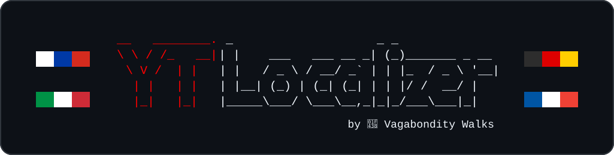
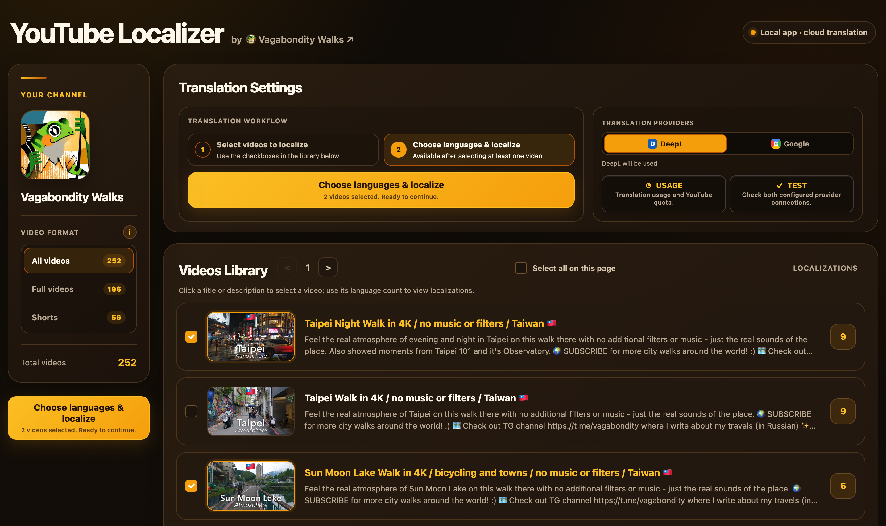

<p align="center">
  
</p>

# YouTube Localizer by Vagabondity

---

A free-to-use, source-available, local-first YouTube metadata translator for creators. Batch-translate and publish localized YouTube video titles and descriptions in multiple languages using DeepL or Google Cloud Translation - while safely running it on your own computer. The application has no subscription fee, you only remain responsible for any usage charges imposed by the provider you choose, but there are generous free tiers in both of them, which you can use to make literally hundreds of localizations for free.
The app updates YouTube localization fields through YouTube Data API v3 and it does not replace the original title or description.

This app has no subscription fee, no app-imposed limits, publicly available source code, and it doesn't ask you to give access to your YT channel to any third-party. It's easy to install and very easy to use! Originally built and improved for localizing videos on the developer's YT city walks channel 🐸 [Vagabondity Walks](https://www.youtube.com/@vagabondity) - now sharing it so other creators can use it too. Feel free to check out the channel it was made for!

Refer to [Quick Start](#quick-start) for a guide to set this app up and start localizing your YT Channel. Refer to [Vagabondity vs ReTranslate.ai comparison](#vagabondity-vs-retranslateai-comparison) to see the comparison between this app and ReTranslate.ai service.

> **Status:** Fully functional and actively improved.

## Preview



## Requirements

- A Google account that manages a YouTube channel.
- Installed [`uv`](https://docs.astral.sh/uv/getting-started/installation/) package manager. _You do not need to install Python or anything else separately apart from `uv` for this app to work_.
- YouTube Data API v3 OAuth credentials (configured in Google Cloud).
- Access keys for at least one translation provider: DeepL API or Google Cloud Translation.

## Features

- 🚀 **Batch localization:** Translate and publish metadata for a single video, a page of videos, or the entire channel in one run.
- 🌍 **Localization-aware selection:** Review each video's source language and existing localizations before choosing target languages. Existing translations are skipped by default, with an option to replace and retranslate them.
- 🧭 **Language compatibility checks:** Before translation starts, the app verifies the video's source language and every target language against the capabilities reported by DeepL and Google Cloud Translation. Provider-only targets are clearly labelled, unsupported combinations are disabled, and videos with different source languages cannot be mixed in one batch.
- 🎬 **Flexible video library:** Filter full-length videos and Shorts, browse by page, and select individual videos, the current page, or the entire channel.
- 🔄 **Multiple translation providers:** Choose explicitly between DeepL and Google Cloud Translation for each localization run.
- 📊 **Live progress tracking:** Follow every video-and-language pair as it is processed, including published, skipped, and failed localizations with their reasons.
- 📈 **Usage and quota visibility:** View DeepL usage, locally tracked Google Cloud Translation usage, and YouTube API quota information from the **USAGE** window.
- ✅ **Provider connection checks:** Test both configured translation providers from the **TEST** window before starting a localization run. The check uses a tiny translation request and does not modify YouTube metadata.
- 🔋 **YouTube quota recovery:** When the daily YouTube API quota is exhausted, the app enters limited mode, keeps cached channel data available, shows the expected reset time, and lets you reconnect when access is restored.
- 💻 **Local-first operation:** The interface runs only on `127.0.0.1`. Credentials and provider settings are stored locally and are used only to authenticate requests to the configured services.
- 🛡️ **Original content protection:** The original video, thumbnail, title, and description remain unchanged; only additional language localizations are published.

## Quick Start

**First-time setup typically takes about 10 minutes.**
Most of that time is spent in Google Cloud creating access for your YouTube channel.
After setup, starting the app normally takes one command and about a minute.

### 1. Download the app and open its folder in Terminal

On this [GitHub page](https://github.com/Polovinkin/Vagabondity-YouTube-Localizer),
click green button **Code → Download ZIP**, extract the ZIP, and open the extracted `Vagabondity-YouTube-Localizer` folder.

Then open Terminal in that folder:

- **macOS:** open the **Terminal** app, type `cd ` (including the space), drag
  the `Vagabondity-YouTube-Localizer` folder from Finder into the Terminal
  window, and press Enter.
- **Windows:** open the folder in File Explorer, click the address bar, type
  `powershell`, and press Enter.

### 2. Install uv

> **Wait, that is this `uv` I need to install?**
> 
> Worry not! `uv` is a popular tool used by software developers around the world - it installs and manages the Python version and packages required by this app. It's basically the best way to minimise the amount of stuff to install on your computer to run this app, and what makes this app basically a "portable" app as you are not installing anything.
> It is safe to install using the official commands below. It's not a regular app, but more like a small tool which becomes accessible in your Terminal. It does not run continuously in the background or use CPU or memory when you are not actively running a `uv` command in the Terminal. It only uses some disk space for the tool itself, Python, and the app's packages.

Copy the command for your operating system into Terminal and press Enter.

macOS and Linux:

```bash
curl -LsSf https://astral.sh/uv/install.sh | sh
```

Windows PowerShell:

```powershell
powershell -ExecutionPolicy ByPass -c "irm https://astral.sh/uv/install.ps1 | iex"
```

Close and reopen Terminal after installation to make `uv` available there. Alternative installation methods
are available in the official [`uv` installation guide](https://docs.astral.sh/uv/getting-started/installation/).

### 3. Create your private settings file

Copy the next command into Terminal and press Enter. It will use the template file to create a config file you will use.
You only need to create this file once.

macOS and Linux:

```bash
cp config/settings.example.toml config/settings.toml
```

Windows PowerShell:

```powershell
Copy-Item config/settings.example.toml config/settings.toml
```

### 4. Give the app access to your YouTube channel

This is required for the app to use data from your YouTube channel. You have to manually create your own Google Cloud project and configure it for that.

1. Open [Google Cloud Console](https://console.cloud.google.com) and create a project, you can use any name, but you can name this project like "YT Localizer". Or you can just select an existing project. Pick this project as an active one.
2. [Enable YouTube Data API v3](https://console.cloud.google.com/marketplace/product/google/youtube.googleapis.com)
   for that project. You can use your emails in the fields (it's your own project after all).
3. Open [Google Auth Platform](https://console.cloud.google.com/auth/overview).
   If asked, click **Get started**, complete the basic app information, and choose **External** as the audience.
4. Open **Audience → Test users**, add the email of the Google account that manages your YouTube channel, and save it.
5. Open [Google Auth Platform → Clients](https://console.cloud.google.com/auth/clients), click **Create client**, and select **Desktop app**. You can leave the default name.
6. When you press **Create**, the window will appear, when you have to download the client JSON file (button below), rename it to `account_client_secrets_main.json`, and move it into the project's `config` folder, so the final path must be `config/account_client_secrets_main.json`.

### 5. Add a translation provider

The easiest starting option is DeepL. If you prefer Google Cloud Translation, follow the [Google Cloud Translation setup](#google-cloud-translation-optional) below. DeepL's and Google's available plans and usage allowances can change, so check the current terms on its plans page.

1. Choose an available API plan on the [DeepL API plans page](https://www.deepl.com/pro-api) - the Developer plan is the one you will most likely need, with the free 1 million symbols quota.
2. Copy your API Key from the [DeepL API Keys & Limits](https://www.deepl.com/en/your-account/keys) section of your DeepL account.
3. Open `config/settings.toml` in any text editor and replace the placeholder:

```toml
[deepl]
api_key = "paste_your_deepl_api_key_here"
```

### 6. Start the app

Run this command from the project folder:

```bash
uv run vagabondity-youtube-localizer
```

The first run takes longer because `uv` downloads Python and the app's packages.
It also opens a Google authorization page in your browser. Sign in with the
user you added in step 4 and approve the requested YouTube permissions. See [First Google authorization](#first-google-authorization) if you have questions about those permissions.

Keep Terminal open while using the app, then open:

<http://127.0.0.1:5050>

### 7. Test with one video first

1. Click **TEST** button in the app and test that translation-provider connection works.
2. Check that your configured provider is chosen on the main screen selector (DeepL or Google).
2. Select one public or unlisted video and pick one language that is not already published.
4. Start localization and follow the progress window.
5. Confirm the result in YouTube Studio before localizing more videos.

To stop the app, return to Terminal and press `Ctrl+C`.

## Local configuration in config/settings.toml

`config/settings.toml` is the central configuration file for both translation providers and YouTube access.
Your private settings and credential files are excluded from Git by `.gitignore`.
Create your private settings file by renaming `config/settings.example.toml` to `config/settings.toml` or by running this command in Terminal in the repository root:

```bash
cp config/settings.example.toml config/settings.toml
```

The two Google credentials are in JSON files because they are downloaded from Google in that format. 
The settings file keeps their paths and the DeepL key in one place.

## Detailed setup reference

The Quick Start above is enough for most people. This section explains the same
credentials in more detail and includes the optional Google translation provider.

### Google setup

#### YouTube access (required)

1. Create or select a project in the
   [Google Cloud Console](https://console.cloud.google.com).
2. Enable **YouTube Data API v3** ([link](https://console.cloud.google.com/marketplace/product/google/youtube.googleapis.com)).

##### Configure Google Auth Platform

1. Open **Google Auth Platform** ([link](https://console.cloud.google.com/auth/overview)) for the same Google Cloud project.
2. If Google Auth Platform has not been initialized for this project yet, click
   **Get started** and fill in the required app name, support email, and
   developer contact fields. You do not need to add a logo, homepage, or privacy
   policy for personal testing and usage.
3. Under **Test users**, click **Add users**, add the Google account that manages
   your YouTube channel, and save the changes.

Only accounts listed under **Test users** can authorize the application while
its publishing status is **Testing**. If you don't add your Google account here, you will not be
able to log in to your Google account when app starts.

##### Create the OAuth client

1. Open **Google Auth Platform → Clients** ([link](https://console.cloud.google.com/auth/clients)).
2. Create an OAuth 2.0 Client ID of type **Desktop app**.
3. Download the resulting client JSON, rename it, and save it to the repository as:

```text
config/account_client_secrets_main.json
```

The first run opens a Google authorization page. The resulting local OAuth
token is saved as `token.pickle` and is excluded from Git.

### Translation provider setup (choose at least one)

#### DeepL

**Recommended for the simplest setup.** Create a DeepL API account using one of
the currently available plans. Plan names, availability, limits, and billing
requirements can change; check the [DeepL API plans page](https://www.deepl.com/pro-api)
for the current terms.

Open `config/settings.toml` and paste the key from **DeepL → Account → API Keys & Limits**:

```toml
[deepl]
api_key = "paste_your_deepl_api_key_here"
```

#### Google Cloud Translation (optional)

This is required only if you want to use Google Cloud Translation.

1. Enable **Cloud Translation API** and billing in the same Google Cloud project.
2. Create a service account with the **Cloud Translation API User** role.
3. Inside this service account, click on Keys tab and create a JSON key for that service account by pressing "Add key -> Create new key", save it, rename and put to config folder as:

```text
config/translate_key.json
```

Do not commit or share `config/settings.toml`, credential JSON files, or
`token.pickle`. These files are excluded from Git. The app keeps them on your
computer and uses them only when authenticating with the configured Google,
YouTube, and translation services.

## Running the app after setup

Running the app is designed to be extremely simple! You just need to run this command from the repository directory, and that's it:

```bash
uv run vagabondity-youtube-localizer
```

On the first run this `uv` command creates `.venv`, installs the exact locked dependencies and required packages,
and downloads Python 3.12 if needed. The app itself does not open a browser tab automatically; open <http://127.0.0.1:5050> after authorization.

### First Google authorization

On first launch, Google may show an “Google hasn’t verified this app” warning because the OAuth app is in Testing mode.

This is expected. If this is your Google Cloud project and the app name is correct:
1. Sign in with an account added to Google Auth Platform → Audience → Test users.
2. Click Continue and approve the requested YouTube permissions. If you see `Error 403: access_denied`, add the selected Google account to the project’s Test users.
3. After authorization, window closes, return to the application by opening <http://127.0.0.1:5050>.

The token is saved locally in `token.pickle`.

While the Google OAuth app remains in **Testing** mode, Google normally expires
the authorization after seven days. If the app asks you to sign in again later,
repeat the same authorization with your listed test-user account.

Stop the application with Ctrl+C at any time.

### Test translation provider connections

The app lets you verify that Google Cloud Translation and DeepL keys work fine before localizing any videos.
In order to do so, click **Test** in **Translation provider** window. The check does not read or update YouTube metadata, it only verifies the actual credentials, API access, and translation request (not just whether a key file) exists - by asking each provider to translate the short phrase `hi` into German (uses only a few characters of translation quota).

## Your first localization

1. Start by selecting one public or unlisted video.
2. Select either **DeepL** or **Google** in the translation-provider switch (depends on which configs did you add).
3. Choose one language that has not been localized yet (all localized version will be shown in the UI).
4. Run the translation and follow the progress of the translation in the window.
5. After it's done - confirm the localized title and description in YouTube Studio.
6. Test **retranslate existing languages** on that same localization only if you intentionally want to replace it.
7. If everything works fine - feel free to translate more videos!

## Common setup problems

- **`uv: command not found`:** close and reopen Terminal after installing `uv`.
  If it still fails, use another method from the
  [`uv` installation guide](https://docs.astral.sh/uv/getting-started/installation/).
- **The app cannot find `config/settings.toml`:** make sure you opened Terminal
  in the project folder and completed step 3 of Quick Start.
- **The app cannot find the OAuth JSON file:** confirm that the downloaded file
  is named exactly `account_client_secrets_main.json` and is inside `config`.
- **`Error 403: access_denied`:** add the Google account you selected to
  **Google Auth Platform → Audience → Test users**, then try again.
- **Google asks you to authorize again after seven days:** this is normal while
  the OAuth app remains in Testing mode.
- **The local page does not open:** keep Terminal running, check it for an error,
  and open <http://127.0.0.1:5050> manually.


#### Why does YouTube show broad permissions?

YouTube does not provide a permission limited to title and description localizations - the scopes accepted for updating video metadata can also authorize video deletion.

The difference here, is that ReTranslate asks you to grant this access to its hosted service. Vagabondity uses an OAuth client you create yourself (so you basically give access to your app in Google Cloud), stores the token locally, and makes no video-deletion API calls - can be easily verified as this directly has a public source code.

## Vagabondity vs ReTranslate.ai comparison

This app is a great alternative to any 3rd-party hosted YouTube metadata localization app, such as ReTranslate.ai.
Comparison table between Vagabondity YouTube Localizer and ReTranslate.ai:

| Topic | Vagabondity YouTube Localizer | ReTranslate.ai |
|-------|-------------------------------|----------------|
| Source code and logic | Source-available under the free-to-use license: public for inspection and free to run, but redistribution, modified releases, resale, and hosted access are prohibited | Not publicly available |
| Where it runs | Locally on your computer | Hosted third-party service |
| Author identity | Dmitrii Polovinkin - [GitHub](https://github.com/Polovinkin) | Unknown |
| YT Channel Safety | Source code contains no calls to YouTube's video-deletion API or anything not intented for localization. Authorization token is created by you, is shared with your own Google Cloud app, access keys are kept on your device. [Details](#why-does-youtube-show-broad-permissions) | ReTranslate Google consent screen explicitly asks for permission to `see, edit and permanently delete" YouTube videos, ratings, comments and captions`, implementation cannot be inspected. |
| Application subscription | None | Pro at $20/month, or Max at $50/month. Free plan exist, but limits are not enough to even partially localize a single video |
| Translation limits | No app-imposed limits. Usage is only limited by providers' limits, as well as a limits of YT daily upload. Providers free quotas are enough to make hundreds of translations for free. | 10 translations to a single chosen language daily. Pro has "higher daily usage capacity" with no specifics, Max is listed as 5x Pro |
| Bulk translations; Multiple video selections | Can translate a whole channel to 50 languages in one go, if needed. | No bulk translations for free. Only allows to localize a single imported video at a time by pasting it's URL manually. |
| Translation speed | Video localization to 20 languages and uploading it to YT takes around 25 seconds, in one go | One translation for a single video takes at least 5 seconds on average, and it's without uploading it to YT |
| Translation providers | Your own fully powered DeepL or Google Cloud Translation accounts | Mostly relatively weak LLM models like GPT-4o mini (default) or Gemini 2.5 Flash. You have to manually hand-select a model for every single language. |
| Localization monitoring | Full translation process with video-language monitoring granularity, results, fails/skips explanations | Simple percentage-based progress bar, no explanations when translation fails or doesn't upload. Can write that upload is partially successful, but list every attempted localization as failed |
| Subtitle translation | No | Yes |
| Channel metadata translation | No | Yes |
| Playlist metadata translation | No (I mean, who needs it?) | Yes, currently marked Beta |


## Project structure and development details

Application code lives in the `src/vagabondity_youtube_localizer` package:

- `app.py` creates the Flask application and defines its HTTP routes.
- `settings.py` reads the central local configuration.
- `localization.py` coordinates translating and publishing video metadata.
- `youtube_client.py` handles YouTube authentication, pagination, and updates.
- `translators/` contains the independent DeepL and Google Cloud providers.
- `templates/` and `static/` contain the local web interface.

### About `uv.lock`

`pyproject.toml` contains the human-readable list of the application's direct dependencies. `uv.lock` is an automatically generated dependency lock file and should not be edited manually.

The long URLs in `uv.lock` point to package files hosted by the official Python Package Index (`pypi.org` and `files.pythonhosted.org`). The file records package versions, platform-specific builds, and SHA-256 hashes so that `uv` can install reproducible dependencies and verify downloaded files. Only the build appropriate for the current operating system and processor is downloaded.

Verify the locked environment and Python syntax:

```bash
uv sync --locked
uv run python -m unittest discover -s tests -v
uv run python -m compileall -q src
```

### Security notes

- The application runs locally and listens on `127.0.0.1`, not on the public network.
- Video titles and descriptions are sent to the selected translation provider.
- YouTube OAuth credentials can update channel metadata. Review selected videos and languages before starting a batch.
- Never publish `config/settings.toml`, Google credential JSON files, or `token.pickle`.
- Revoke access at any time from your Google Account's third-party access page.

## License

Vagabondity YouTube Localizer is **source-available, free-to-use proprietary software** under the [Vagabondity Free-to-Use License](LICENSE).

You may, at no charge:

- download, install, and run the unmodified application;
- use it for personal, commercial, and monetized YouTube channels that you own or are authorized to manage;
- use it while providing localization services to clients, as long as you do not give them access to the software itself;
- inspect the public source code to verify how the application handles credentials and YouTube access;
- freely use, publish, and monetize the translations and other output produced with the application.

You may not redistribute, resell, sublicense, rebrand, or publish modified copies of the software, use its source code to create a competing product, or offer the application as a hosted service. Configuration changes and files created during normal operation are allowed.

This project is **not open source under the OSI definition**: its source is public for transparency, but reuse and redistribution are restricted. Sharing a link to the official repository is allowed and encouraged.

The project contains portions derived from [YouTube-Video-Metadata-Translator](https://github.com/jordicor/YouTube-Video-Metadata-Translator) by Jordi Cor.
Those third-party portions remain licensed separately under the MIT License and are not restricted by the Vagabondity Free-to-Use License.

See [`LICENSE`](LICENSE), [`THIRD_PARTY_NOTICES.md`](THIRD_PARTY_NOTICES.md), and [`LICENSES/MIT-JORDI-COR.txt`](LICENSES/MIT-JORDI-COR.txt) for the complete terms.

## Problems or bugs?

If you run into a problem, find a bug, or need help with the app, please
[create a GitHub Issue](https://github.com/Polovinkin/Vagabondity-YouTube-Localizer/issues/new)
and describe what happened. If possible, include the full error message shown in Terminal and all the steps that led to the problem. More details - the better!
